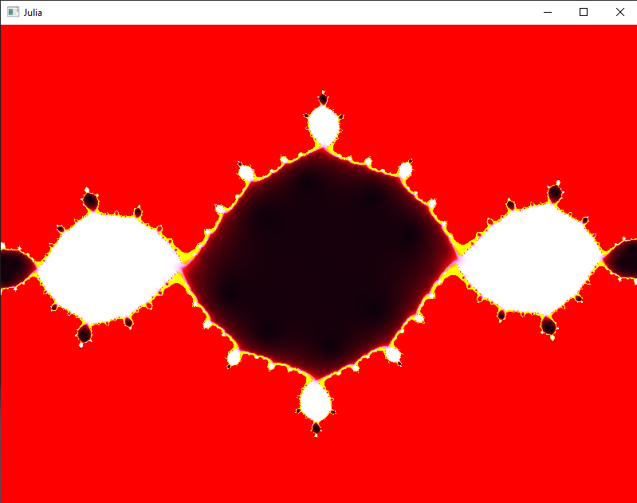
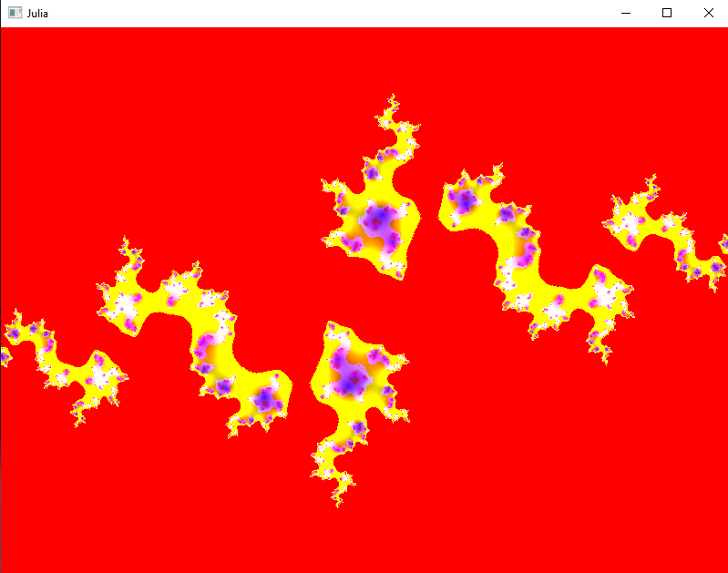

# Julia Set Renderer

<!-- -->

This is a C++ project that allows you to render and visualize the Julia Set using OpenGL shaders. The Julia Set is a famous fractal in mathematics, and this project provides a graphical representation of it. The project uses the Conan package manager for handling dependencies and includes GPL-3.0 license for distribution and use.

## Table of Contents

- [Introduction](#introduction)
- [Features](#features)
- [Getting Started](#getting-started)
- [Dependencies](#dependencies)
- [Gallery](#gallery)
- [License](#license)

## Introduction

The Julia Set is a fractal defined in the complex plane. This project allows you to explore and visualize the intricate patterns of the Julia Set using OpenGL shaders for rendering. With the help of the Conan package manager, the project simplifies dependency management and ensures easy setup.

## Features

- Render the mesmerizing Julia Set fractal.
- Utilize OpenGL shaders for efficient rendering.
- Easily manage project dependencies with Conan.

## Getting Started

To get started with the Julia Set Renderer, follow these steps:

1. **Clone the Repository:** Clone this repository to your local machine using the following command:

   ```
   git clone https://github.com/adidvar/julia-set.git
   ```

2. **Navigate to Project Directory:** Move to the project directory:

   ```
   cd julia-set
   ```

3. **Install Dependencies:** 

   ```
   conan install . --output-folder=build
   ```

4. **Build the Project:** 

 ```
   cd build
   cmake -S .. --preset conan-default
   ```

5. **Install the Application and Run:** 

 ```
   cmake --install .
   ./JuliaSet
   ```

## Dependencies

The project uses the following dependencies, which will be automatically installed using Conan:

- OpenGL: A graphics library for rendering 2D and 3D graphics.
- GLFW 3.3.8
- GLAD 0.1.36
- GLM
- conan

## Gallery




## License

This project is licensed under the GNU General Public License v3.0. For more details, see the [LICENSE](LICENSE) file.
